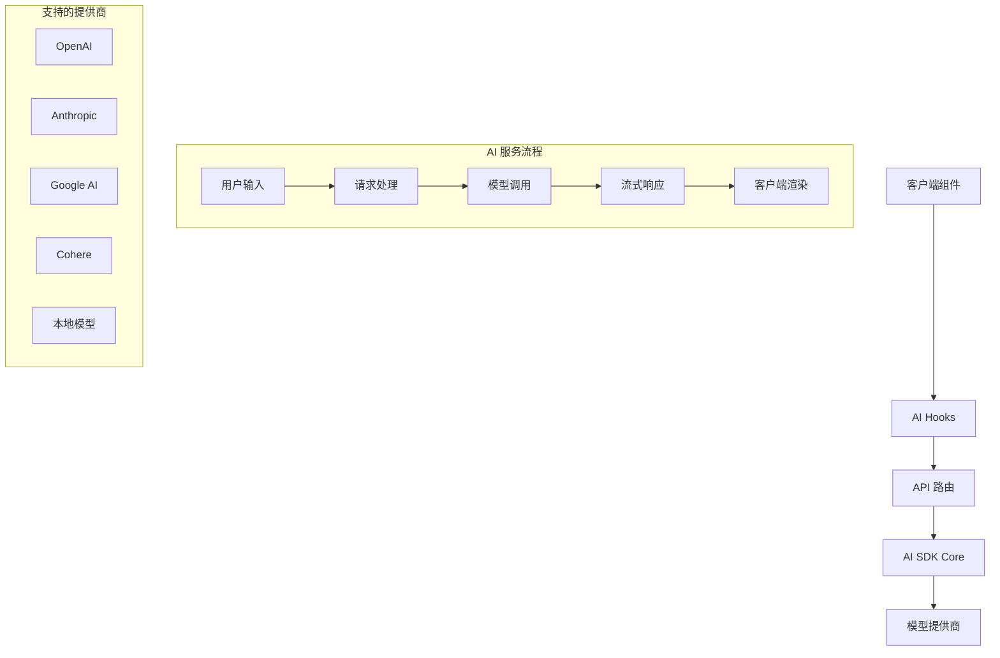

# Vercel AI SDK 集成指南

Vibetake 集成了 [Vercel AI SDK](https://sdk.vercel.ai)，为你的应用提供强大的 AI 功能。本文档将详细介绍如何配置和使用 AI 服务。

## 概述

Vercel AI SDK 是一个开源库，提供了与多种 AI 模型交互的统一接口。它支持流式响应、工具调用、结构化输出等高级功能。

### 核心特性

- 🤖 **多模型支持** - OpenAI、Anthropic、Google、Cohere 等
- 💬 **流式聊天** - 实时响应和打字效果
- 🔧 **工具调用** - 函数调用和外部 API 集成
- 📝 **文本生成** - 智能内容创作和补全
- 🖼️ **多模态** - 图像分析和生成
- 🎯 **结构化输出** - JSON 格式的结构化数据生成
- ⚡ **边缘运行时** - 优化的性能和延迟

## 系统架构



## 安装和配置

### 1. 安装依赖

```bash
# 安装 Vercel AI SDK
npm install ai @ai-sdk/openai @ai-sdk/anthropic @ai-sdk/google

# 或使用其他提供商
npm install @ai-sdk/cohere @ai-sdk/mistral
```

### 2. 环境变量配置

在 `.env.local` 文件中配置 API 密钥：

```bash
# OpenAI 配置
OPENAI_API_KEY=sk-...

# Anthropic 配置
ANTHROPIC_API_KEY=sk-ant-...

# Google AI 配置
GOOGLE_GENERATIVE_AI_API_KEY=...

# Cohere 配置
COHERE_API_KEY=...

# 自定义配置
AI_MODEL_PROVIDER=openai
AI_DEFAULT_MODEL=gpt-4-turbo
```

## 快速开始

### 1. 创建 AI 服务配置

首先创建 AI 服务的配置文件：

```typescript
// src/services/ai/config.ts
import { openai } from '@ai-sdk/openai';
import { anthropic } from '@ai-sdk/anthropic';
import { google } from '@ai-sdk/google';

// 模型配置
export const models = {
  // OpenAI 模型
  'gpt-4-turbo': openai('gpt-4-turbo'),
  'gpt-4': openai('gpt-4'),
  'gpt-3.5-turbo': openai('gpt-3.5-turbo'),
  
  // Anthropic 模型
  'claude-3-opus': anthropic('claude-3-opus-20240229'),
  'claude-3-sonnet': anthropic('claude-3-sonnet-20240229'),
  'claude-3-haiku': anthropic('claude-3-haiku-20240307'),
  
  // Google 模型
  'gemini-pro': google('models/gemini-pro'),
  'gemini-pro-vision': google('models/gemini-pro-vision'),
};

// 默认模型配置
export const defaultModel = models[process.env.AI_DEFAULT_MODEL as keyof typeof models] || models['gpt-4-turbo'];

// 模型选择器
export function getModel(modelName: string) {
  return models[modelName as keyof typeof models] || defaultModel;
}
```

### 2. 创建聊天 API 路由

```typescript
// src/app/api/chat/route.ts
import { streamText, convertToCoreMessages } from 'ai';
import { getModel } from '@/services/ai/config';
import { auth } from '@/services/userauth/auth';
import { headers } from 'next/headers';

export async function POST(req: Request) {
  try {
    // 验证用户身份
    const session = await auth.api.getSession({
      headers: headers(),
    });

    if (!session) {
      return new Response('Unauthorized', { status: 401 });
    }

    const { messages, model = 'gpt-4-turbo' } = await req.json();

    // 验证消息格式
    if (!messages || !Array.isArray(messages)) {
      return new Response('Invalid messages format', { status: 400 });
    }

    // 转换消息格式
    const coreMessages = convertToCoreMessages(messages);

    // 生成流式响应
    const result = await streamText({
      model: getModel(model),
      messages: coreMessages,
      maxTokens: 1000,
      temperature: 0.7,
      // 系统提示
      system: '你是一个有用的 AI 助手，请用中文回答问题。',
    });

    return result.toDataStreamResponse();
  } catch (error) {
    console.error('Chat API error:', error);
    return new Response('Internal Server Error', { status: 500 });
  }
}
```

### 3. 创建聊天组件

```tsx
// src/components/ai/chat.tsx
'use client';

import { useChat } from 'ai/react';
import { Button } from '@/components/ui/button';
import { Input } from '@/components/ui/input';
import { Card, CardContent, CardHeader, CardTitle } from '@/components/ui/card';
import { ScrollArea } from '@/components/ui/scroll-area';
import { Avatar, AvatarFallback } from '@/components/ui/avatar';
import { Send, Bot, User } from 'lucide-react';

export function ChatComponent() {
  const { 
    messages, 
    input, 
    handleInputChange, 
    handleSubmit, 
    isLoading,
    error 
  } = useChat({
    api: '/api/chat',
    onError: (error) => {
      console.error('Chat error:', error);
    },
  });

  return (
    <Card className="w-full max-w-2xl mx-auto h-[600px] flex flex-col">
      <CardHeader>
        <CardTitle className="flex items-center gap-2">
          <Bot className="w-5 h-5" />
          AI 助手
        </CardTitle>
      </CardHeader>
      
      <CardContent className="flex-1 flex flex-col gap-4">
        <ScrollArea className="flex-1 pr-4">
          <div className="space-y-4">
            {messages.map((message) => (
              <div
                key={message.id}
                className={`flex gap-3 ${
                  message.role === 'user' ? 'justify-end' : 'justify-start'
                }`}
              >
                <div className={`flex gap-3 max-w-[80%] ${
                  message.role === 'user' ? 'flex-row-reverse' : 'flex-row'
                }`}>
                  <Avatar className="w-8 h-8">
                    <AvatarFallback>
                      {message.role === 'user' ? (
                        <User className="w-4 h-4" />
                      ) : (
                        <Bot className="w-4 h-4" />
                      )}
                    </AvatarFallback>
                  </Avatar>
                  
                  <div className={`rounded-lg px-3 py-2 ${
                    message.role === 'user'
                      ? 'bg-primary text-primary-foreground'
                      : 'bg-muted'
                  }`}>
                    <p className="text-sm whitespace-pre-wrap">
                      {message.content}
                    </p>
                  </div>
                </div>
              </div>
            ))}
            
            {isLoading && (
              <div className="flex gap-3 justify-start">
                <Avatar className="w-8 h-8">
                  <AvatarFallback>
                    <Bot className="w-4 h-4" />
                  </AvatarFallback>
                </Avatar>
                <div className="bg-muted rounded-lg px-3 py-2">
                  <div className="flex space-x-1">
                    <div className="w-2 h-2 bg-gray-400 rounded-full animate-bounce"></div>
                    <div className="w-2 h-2 bg-gray-400 rounded-full animate-bounce" style={{ animationDelay: '0.1s' }}></div>
                    <div className="w-2 h-2 bg-gray-400 rounded-full animate-bounce" style={{ animationDelay: '0.2s' }}></div>
                  </div>
                </div>
              </div>
            )}
          </div>
        </ScrollArea>

        {error && (
          <div className="p-3 text-sm text-red-600 bg-red-50 border border-red-200 rounded-lg">
            发生错误：{error.message}
          </div>
        )}

        <form onSubmit={handleSubmit} className="flex gap-2">
          <Input
            value={input}
            onChange={handleInputChange}
            placeholder="输入你的问题..."
            disabled={isLoading}
            className="flex-1"
          />
          <Button type="submit" disabled={isLoading || !input.trim()}>
            <Send className="w-4 h-4" />
          </Button>
        </form>
      </CardContent>
    </Card>
  );
}
```

## 核心功能

### 1. 文本生成

```typescript
// src/services/ai/text-generation.ts
import { generateText } from 'ai';
import { getModel } from './config';

export async function generateContent(
  prompt: string,
  options: {
    model?: string;
    maxTokens?: number;
    temperature?: number;
    system?: string;
  } = {}
) {
  const {
    model = 'gpt-4-turbo',
    maxTokens = 1000,
    temperature = 0.7,
    system = '你是一个有用的 AI 助手。'
  } = options;

  try {
    const { text, usage } = await generateText({
      model: getModel(model),
      prompt,
      system,
      maxTokens,
      temperature,
    });

    return {
      success: true,
      text,
      usage,
    };
  } catch (error) {
    console.error('Text generation error:', error);
    return {
      success: false,
      error: error instanceof Error ? error.message : 'Unknown error',
    };
  }
}

// 使用示例
const result = await generateContent(
  '写一篇关于 React 18 新特性的技术文章大纲',
  {
    model: 'gpt-4-turbo',
    maxTokens: 800,
    temperature: 0.8,
  }
);

if (result.success) {
  console.log('生成的内容:', result.text);
  console.log('使用情况:', result.usage);
} else {
  console.error('生成失败:', result.error);
}
```

### 2. 工具调用 (Function Calling)

工具调用允许 AI 模型执行外部函数，获取实时数据或执行特定操作：

```typescript
// src/services/ai/tools.ts
import { generateText, tool } from 'ai';
import { getModel } from './config';
import { z } from 'zod';

// 定义工具
export const weatherTool = tool({
  description: '获取指定城市的天气信息',
  parameters: z.object({
    city: z.string().describe('城市名称'),
    unit: z.enum(['celsius', 'fahrenheit']).optional().describe('温度单位'),
  }),
  execute: async ({ city, unit = 'celsius' }) => {
    // 这里应该调用真实的天气 API
    const mockWeatherData = {
      city,
      temperature: unit === 'celsius' ? 25 : 77,
      condition: '晴天',
      humidity: 60,
      windSpeed: 10,
    };
    
    return JSON.stringify(mockWeatherData);
  },
});

export const calculatorTool = tool({
  description: '执行数学计算',
  parameters: z.object({
    expression: z.string().describe('数学表达式，如 "2 + 3 * 4"'),
  }),
  execute: async ({ expression }) => {
    try {
      // 安全的数学表达式计算
      const result = Function(`"use strict"; return (${expression})`)();
      return `计算结果: ${expression} = ${result}`;
    } catch (error) {
      return `计算错误: 无效的表达式 "${expression}"`;
    }
  },
});

// 使用工具的聊天 API
export async function chatWithTools(
  messages: any[],
  availableTools: string[] = ['weather', 'calculator']
) {
  const tools: Record<string, any> = {};
  
  if (availableTools.includes('weather')) {
    tools.getWeather = weatherTool;
  }
  
  if (availableTools.includes('calculator')) {
    tools.calculate = calculatorTool;
  }

  const { text, toolCalls, toolResults } = await generateText({
    model: getModel('gpt-4-turbo'),
    messages,
    tools,
    maxToolRoundtrips: 3, // 最多执行3轮工具调用
  });

  return {
    text,
    toolCalls,
    toolResults,
  };
}
```

### 3. 结构化输出

生成符合特定 schema 的结构化数据：

```typescript
// src/services/ai/structured-output.ts
import { generateObject } from 'ai';
import { getModel } from './config';
import { z } from 'zod';

// 定义数据结构
export const articleSchema = z.object({
  title: z.string().describe('文章标题'),
  summary: z.string().describe('文章摘要'),
  sections: z.array(z.object({
    heading: z.string().describe('章节标题'),
    content: z.string().describe('章节内容'),
    keyPoints: z.array(z.string()).describe('关键要点'),
  })).describe('文章章节'),
  tags: z.array(z.string()).describe('文章标签'),
  estimatedReadTime: z.number().describe('预计阅读时间（分钟）'),
});

export const userProfileSchema = z.object({
  name: z.string(),
  age: z.number(),
  interests: z.array(z.string()),
  skills: z.array(z.object({
    name: z.string(),
    level: z.enum(['beginner', 'intermediate', 'advanced']),
  })),
  bio: z.string(),
});

// 生成结构化文章
export async function generateArticle(topic: string) {
  const { object } = await generateObject({
    model: getModel('gpt-4-turbo'),
    schema: articleSchema,
    prompt: `写一篇关于"${topic}"的技术文章，包含详细的章节和要点。`,
  });

  return object;
}

// 分析用户简介
export async function analyzeUserProfile(profileText: string) {
  const { object } = await generateObject({
    model: getModel('gpt-4-turbo'),
    schema: userProfileSchema,
    prompt: `分析以下用户简介，提取结构化信息：\n\n${profileText}`,
  });

  return object;
}
```

### 4. 图像分析

处理和分析图像内容：

```typescript
// src/services/ai/image-analysis.ts
import { generateObject } from 'ai';
import { getModel } from './config';
import { z } from 'zod';

export const imageAnalysisSchema = z.object({
  description: z.string().describe('图像的详细描述'),
  objects: z.array(z.object({
    name: z.string().describe('物体名称'),
    confidence: z.number().describe('识别置信度 0-1'),
    position: z.string().describe('物体在图像中的位置'),
  })).describe('识别到的物体'),
  colors: z.array(z.string()).describe('主要颜色'),
  mood: z.string().describe('图像的情感色调'),
  tags: z.array(z.string()).describe('相关标签'),
  isAppropriate: z.boolean().describe('内容是否合适'),
});

export async function analyzeImage(imageUrl: string) {
  const { object } = await generateObject({
    model: getModel('gemini-pro-vision'), // 使用支持视觉的模型
    schema: imageAnalysisSchema,
    messages: [
      {
        role: 'user',
        content: [
          { type: 'text', text: '请分析这张图片的内容' },
          { type: 'image', image: imageUrl },
        ],
      },
    ],
  });

  return object;
}

// 图像内容审核
export async function moderateImage(imageUrl: string) {
  const analysis = await analyzeImage(imageUrl);
  
  return {
    isAppropriate: analysis.isAppropriate,
    reason: analysis.isAppropriate ? '内容合适' : '内容可能不合适',
    details: analysis,
  };
}
```

## 高级功能

### 1. 流式文本补全

```tsx
// src/components/ai/text-completion.tsx
'use client';

import { useCompletion } from 'ai/react';
import { Button } from '@/components/ui/button';
import { Textarea } from '@/components/ui/textarea';
import { Card, CardContent, CardHeader, CardTitle } from '@/components/ui/card';

export function TextCompletion() {
  const {
    completion,
    input,
    handleInputChange,
    handleSubmit,
    isLoading,
    stop,
  } = useCompletion({
    api: '/api/completion',
  });

  return (
    <Card className="w-full max-w-2xl mx-auto">
      <CardHeader>
        <CardTitle>智能文本补全</CardTitle>
      </CardHeader>
      <CardContent className="space-y-4">
        <form onSubmit={handleSubmit} className="space-y-4">
          <Textarea
            value={input}
            onChange={handleInputChange}
            placeholder="输入文本开头，AI 将帮你续写..."
            rows={4}
          />
          <div className="flex gap-2">
            <Button type="submit" disabled={isLoading}>
              {isLoading ? '生成中...' : '开始补全'}
            </Button>
            {isLoading && (
              <Button type="button" variant="outline" onClick={stop}>
                停止
              </Button>
            )}
          </div>
        </form>

        {completion && (
          <div className="mt-4">
            <h3 className="font-semibold mb-2">AI 续写内容：</h3>
            <div className="p-4 bg-muted rounded-lg">
              <p className="whitespace-pre-wrap">{completion}</p>
            </div>
          </div>
        )}
      </CardContent>
    </Card>
  );
}
```

### 2. 多轮对话管理

```typescript
// src/services/ai/conversation.ts
import { generateText } from 'ai';
import { getModel } from './config';

export interface ConversationMessage {
  id: string;
  role: 'user' | 'assistant' | 'system';
  content: string;
  timestamp: Date;
  metadata?: Record<string, any>;
}

export class ConversationManager {
  private messages: ConversationMessage[] = [];
  private maxMessages: number = 20; // 最大消息数量
  private systemPrompt: string;

  constructor(systemPrompt: string = '你是一个有用的 AI 助手。') {
    this.systemPrompt = systemPrompt;
  }

  addMessage(role: 'user' | 'assistant', content: string, metadata?: Record<string, any>) {
    const message: ConversationMessage = {
      id: crypto.randomUUID(),
      role,
      content,
      timestamp: new Date(),
      metadata,
    };

    this.messages.push(message);

    // 保持消息数量在限制内
    if (this.messages.length > this.maxMessages) {
      this.messages = this.messages.slice(-this.maxMessages);
    }

    return message;
  }

  async generateResponse(userMessage: string, model: string = 'gpt-4-turbo') {
    // 添加用户消息
    this.addMessage('user', userMessage);

    // 准备消息历史
    const messages = [
      { role: 'system' as const, content: this.systemPrompt },
      ...this.messages.map(msg => ({
        role: msg.role as 'user' | 'assistant',
        content: msg.content,
      })),
    ];

    try {
      const { text, usage } = await generateText({
        model: getModel(model),
        messages,
        maxTokens: 1000,
        temperature: 0.7,
      });

      // 添加 AI 响应
      const assistantMessage = this.addMessage('assistant', text, { usage });

      return {
        success: true,
        message: assistantMessage,
        usage,
      };
    } catch (error) {
      console.error('Conversation error:', error);
      return {
        success: false,
        error: error instanceof Error ? error.message : 'Unknown error',
      };
    }
  }

  getMessages() {
    return [...this.messages];
  }

  clearHistory() {
    this.messages = [];
  }

  exportConversation() {
    return {
      systemPrompt: this.systemPrompt,
      messages: this.messages,
      exportedAt: new Date(),
    };
  }
}
```

### 3. AI 助手集成

```tsx
// src/components/ai/ai-assistant.tsx
'use client';

import { useState } from 'react';
import { ConversationManager } from '@/services/ai/conversation';
import { Button } from '@/components/ui/button';
import { Input } from '@/components/ui/input';
import { Select, SelectContent, SelectItem, SelectTrigger, SelectValue } from '@/components/ui/select';
import { Card, CardContent, CardHeader, CardTitle } from '@/components/ui/card';
import { Badge } from '@/components/ui/badge';

const AI_MODELS = [
  { value: 'gpt-4-turbo', label: 'GPT-4 Turbo' },
  { value: 'gpt-4', label: 'GPT-4' },
  { value: 'claude-3-opus', label: 'Claude 3 Opus' },
  { value: 'claude-3-sonnet', label: 'Claude 3 Sonnet' },
  { value: 'gemini-pro', label: 'Gemini Pro' },
];

export function AIAssistant() {
  const [conversation] = useState(() => new ConversationManager());
  const [messages, setMessages] = useState(conversation.getMessages());
  const [input, setInput] = useState('');
  const [selectedModel, setSelectedModel] = useState('gpt-4-turbo');
  const [isLoading, setIsLoading] = useState(false);

  const handleSubmit = async (e: React.FormEvent) => {
    e.preventDefault();
    if (!input.trim() || isLoading) return;

    setIsLoading(true);
    const userInput = input;
    setInput('');

    try {
      const result = await conversation.generateResponse(userInput, selectedModel);
      
      if (result.success) {
        setMessages(conversation.getMessages());
      } else {
        console.error('AI response error:', result.error);
      }
    } catch (error) {
      console.error('Submit error:', error);
    } finally {
      setIsLoading(false);
    }
  };

  return (
    <Card className="w-full max-w-4xl mx-auto h-[700px] flex flex-col">
      <CardHeader>
        <div className="flex items-center justify-between">
          <CardTitle>AI 智能助手</CardTitle>
          <div className="flex items-center gap-2">
            <Select value={selectedModel} onValueChange={setSelectedModel}>
              <SelectTrigger className="w-40">
                <SelectValue />
              </SelectTrigger>
              <SelectContent>
                {AI_MODELS.map((model) => (
                  <SelectItem key={model.value} value={model.value}>
                    {model.label}
                  </SelectItem>
                ))}
              </SelectContent>
            </Select>
            <Button
              variant="outline"
              size="sm"
              onClick={() => {
                conversation.clearHistory();
                setMessages([]);
              }}
            >
              清空对话
            </Button>
          </div>
        </div>
      </CardHeader>

      <CardContent className="flex-1 flex flex-col gap-4">
        <div className="flex-1 overflow-y-auto space-y-4">
          {messages.map((message) => (
            <div
              key={message.id}
              className={`flex ${message.role === 'user' ? 'justify-end' : 'justify-start'}`}
            >
              <div className={`max-w-[80%] rounded-lg p-3 ${
                message.role === 'user'
                  ? 'bg-primary text-primary-foreground'
                  : 'bg-muted'
              }`}>
                <div className="flex items-center gap-2 mb-1">
                  <Badge variant="secondary" className="text-xs">
                    {message.role === 'user' ? '用户' : 'AI'}
                  </Badge>
                  <span className="text-xs text-muted-foreground">
                    {message.timestamp.toLocaleTimeString()}
                  </span>
                </div>
                <p className="whitespace-pre-wrap">{message.content}</p>
                {message.metadata?.usage && (
                  <div className="text-xs text-muted-foreground mt-2">
                    Tokens: {message.metadata.usage.totalTokens}
                  </div>
                )}
              </div>
            </div>
          ))}
          
          {isLoading && (
            <div className="flex justify-start">
              <div className="bg-muted rounded-lg p-3">
                <div className="flex items-center gap-2">
                  <div className="w-2 h-2 bg-gray-400 rounded-full animate-bounce"></div>
                  <div className="w-2 h-2 bg-gray-400 rounded-full animate-bounce" style={{ animationDelay: '0.1s' }}></div>
                  <div className="w-2 h-2 bg-gray-400 rounded-full animate-bounce" style={{ animationDelay: '0.2s' }}></div>
                </div>
              </div>
            </div>
          )}
        </div>

        <form onSubmit={handleSubmit} className="flex gap-2">
          <Input
            value={input}
            onChange={(e) => setInput(e.target.value)}
            placeholder="输入你的问题..."
            disabled={isLoading}
            className="flex-1"
          />
          <Button type="submit" disabled={isLoading || !input.trim()}>
            发送
          </Button>
        </form>
      </CardContent>
    </Card>
  );
}
```

## 性能优化

### 1. 请求缓存

```typescript
// src/services/ai/cache.ts
interface CacheEntry {
  result: any;
  timestamp: number;
  ttl: number;
}

class AICache {
  private cache = new Map<string, CacheEntry>();

  set(key: string, value: any, ttlMs: number = 300000) { // 默认5分钟
    this.cache.set(key, {
      result: value,
      timestamp: Date.now(),
      ttl: ttlMs,
    });
  }

  get(key: string): any | null {
    const entry = this.cache.get(key);
    if (!entry) return null;

    if (Date.now() - entry.timestamp > entry.ttl) {
      this.cache.delete(key);
      return null;
    }

    return entry.result;
  }

  clear() {
    this.cache.clear();
  }

  // 生成缓存键
  generateKey(prompt: string, model: string, options: any = {}): string {
    return `${model}:${JSON.stringify({ prompt, ...options })}`;
  }
}

export const aiCache = new AICache();

// 带缓存的文本生成
export async function generateTextWithCache(
  prompt: string,
  options: any = {}
) {
  const cacheKey = aiCache.generateKey(prompt, options.model || 'gpt-4-turbo', options);
  
  // 尝试从缓存获取
  const cached = aiCache.get(cacheKey);
  if (cached) {
    return { ...cached, fromCache: true };
  }

  // 生成新内容
  const result = await generateContent(prompt, options);
  
  // 缓存结果
  if (result.success) {
    aiCache.set(cacheKey, result);
  }

  return { ...result, fromCache: false };
}
```

### 2. 速率限制

```typescript
// src/services/ai/rate-limiter.ts
class RateLimiter {
  private requests = new Map<string, number[]>();
  private maxRequests: number;
  private windowMs: number;

  constructor(maxRequests: number = 10, windowMs: number = 60000) {
    this.maxRequests = maxRequests;
    this.windowMs = windowMs;
  }

  async checkLimit(userId: string): Promise<boolean> {
    const now = Date.now();
    const userRequests = this.requests.get(userId) || [];
    
    // 清理过期的请求记录
    const validRequests = userRequests.filter(
      timestamp => now - timestamp < this.windowMs
    );

    if (validRequests.length >= this.maxRequests) {
      return false; // 超出限制
    }

    // 记录新请求
    validRequests.push(now);
    this.requests.set(userId, validRequests);
    
    return true; // 允许请求
  }

  getRemainingRequests(userId: string): number {
    const now = Date.now();
    const userRequests = this.requests.get(userId) || [];
    const validRequests = userRequests.filter(
      timestamp => now - timestamp < this.windowMs
    );
    
    return Math.max(0, this.maxRequests - validRequests.length);
  }
}

export const rateLimiter = new RateLimiter(20, 60000); // 每分钟20次请求
```

## 安全和最佳实践

### 1. 输入验证和清理

```typescript
// src/services/ai/security.ts
import { z } from 'zod';

// 输入验证 schema
export const chatInputSchema = z.object({
  message: z.string()
    .min(1, '消息不能为空')
    .max(4000, '消息长度不能超过4000字符')
    .refine(
      (msg) => !containsHarmfulContent(msg),
      '消息包含不当内容'
    ),
  model: z.string().optional(),
  temperature: z.number().min(0).max(2).optional(),
  maxTokens: z.number().min(1).max(4000).optional(),
});

// 检查有害内容
function containsHarmfulContent(text: string): boolean {
  const harmfulPatterns = [
    /暴力|血腥|恐怖/i,
    /色情|成人|不雅/i,
    /仇恨|歧视|偏见/i,
    // 添加更多模式...
  ];

  return harmfulPatterns.some(pattern => pattern.test(text));
}

// 清理输出内容
export function sanitizeOutput(text: string): string {
  // 移除潜在的恶意内容
  return text
    .replace(/<script\b[^<]*(?:(?!<\/script>)<[^<]*)*<\/script>/gi, '')
    .replace(/javascript:/gi, '')
    .replace(/on\w+\s*=/gi, '');
}

// 内容审核
export async function moderateContent(text: string): Promise<{
  isAppropriate: boolean;
  reason?: string;
  confidence: number;
}> {
  // 这里可以集成第三方内容审核服务
  // 如 OpenAI Moderation API
  
  const isAppropriate = !containsHarmfulContent(text);
  
  return {
    isAppropriate,
    reason: isAppropriate ? undefined : '内容可能包含不当信息',
    confidence: 0.8,
  };
}
```

### 2. 成本监控

```typescript
// src/services/ai/cost-monitor.ts
interface UsageRecord {
  userId: string;
  model: string;
  inputTokens: number;
  outputTokens: number;
  cost: number;
  timestamp: Date;
}

class CostMonitor {
  private usage: UsageRecord[] = [];
  
  // 模型定价（每1000 tokens的价格，单位：美元）
  private pricing = {
    'gpt-4-turbo': { input: 0.01, output: 0.03 },
    'gpt-4': { input: 0.03, output: 0.06 },
    'gpt-3.5-turbo': { input: 0.001, output: 0.002 },
    'claude-3-opus': { input: 0.015, output: 0.075 },
    'claude-3-sonnet': { input: 0.003, output: 0.015 },
  };

  recordUsage(
    userId: string,
    model: string,
    inputTokens: number,
    outputTokens: number
  ) {
    const modelPricing = this.pricing[model as keyof typeof this.pricing];
    if (!modelPricing) return;

    const cost = 
      (inputTokens / 1000) * modelPricing.input +
      (outputTokens / 1000) * modelPricing.output;

    const record: UsageRecord = {
      userId,
      model,
      inputTokens,
      outputTokens,
      cost,
      timestamp: new Date(),
    };

    this.usage.push(record);
  }

  getUserCost(userId: string, days: number = 30): number {
    const cutoff = new Date();
    cutoff.setDate(cutoff.getDate() - days);

    return this.usage
      .filter(record => 
        record.userId === userId && 
        record.timestamp >= cutoff
      )
      .reduce((total, record) => total + record.cost, 0);
  }

  getTotalCost(days: number = 30): number {
    const cutoff = new Date();
    cutoff.setDate(cutoff.getDate() - days);

    return this.usage
      .filter(record => record.timestamp >= cutoff)
      .reduce((total, record) => total + record.cost, 0);
  }

  getUsageStats(days: number = 30) {
    const cutoff = new Date();
    cutoff.setDate(cutoff.getDate() - days);

    const recentUsage = this.usage.filter(
      record => record.timestamp >= cutoff
    );

    const stats = {
      totalRequests: recentUsage.length,
      totalCost: recentUsage.reduce((sum, r) => sum + r.cost, 0),
      totalTokens: recentUsage.reduce((sum, r) => sum + r.inputTokens + r.outputTokens, 0),
      modelUsage: {} as Record<string, number>,
    };

    recentUsage.forEach(record => {
      stats.modelUsage[record.model] = (stats.modelUsage[record.model] || 0) + 1;
    });

    return stats;
  }
}

export const costMonitor = new CostMonitor();
```

## 故障排除

### 常见问题

1. **API 密钥错误**
   - 检查环境变量配置
   - 确认密钥格式正确
   - 验证密钥权限

2. **请求超时**
   - 增加超时时间设置
   - 检查网络连接
   - 考虑使用重试机制

3. **Token 限制**
   - 优化提示词长度
   - 使用适当的 maxTokens 设置
   - 考虑分段处理长文本

4. **成本过高**
   - 实施缓存策略
   - 使用更便宜的模型
   - 优化提示词效率

### 调试技巧

```typescript
// 启用详细日志
const debugMode = process.env.NODE_ENV === 'development';

if (debugMode) {
  console.log('AI Request:', {
    model,
    prompt: prompt.substring(0, 100) + '...',
    options,
  });
}

// 性能监控
const startTime = Date.now();
const result = await generateText(/* ... */);
const duration = Date.now() - startTime;

if (debugMode) {
  console.log('AI Response:', {
    duration: `${duration}ms`,
    tokens: result.usage?.totalTokens,
    cost: calculateCost(result.usage),
  });
}
```

通过本文档，你应该能够在 Vibe Template 中充分利用 Vercel AI SDK 的强大功能。记住始终关注安全性、成本控制和用户体验。如需更多信息，请参考 [Vercel AI SDK 官方文档](https://sdk.vercel.ai/docs)。