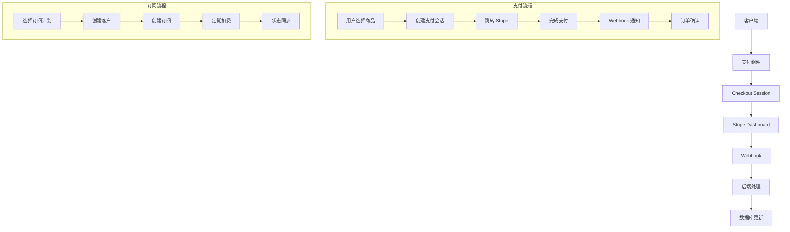

# Stripe 支付集成指南

vibetake 集成了 [Stripe](https://stripe.com) 支付系统，为你的应用提供完整的支付解决方案。本文档将详细介绍如何配置和使用 Stripe 支付功能。

## 概述

Stripe 是全球领先的在线支付处理平台，提供安全、可靠的支付基础设施。vibetake 的 Stripe 集成支持多种支付场景和业务模式。

### 核心特性

- 💳 **多种支付方式** - 信用卡、借记卡、数字钱包等
- 🔄 **订阅管理** - 灵活的订阅计费和管理
- 📊 **支付分析** - 详细的交易数据和报告
- 🔒 **安全合规** - PCI DSS 合规，数据加密保护
- 🌍 **全球支持** - 支持135+种货币和45+个国家
- 🎯 **智能路由** - 优化支付成功率和成本
- 📱 **移动优化** - 响应式支付界面
- 🔧 **强大 API** - 灵活的集成和自定义

## 系统架构



## 安装和配置

### 1. 安装依赖

```bash
# 安装 Stripe 相关包
npm install stripe @stripe/stripe-js @stripe/react-stripe-js

# 安装类型定义（如果使用 TypeScript）
npm install --save-dev @types/stripe
```

### 2. 环境变量配置

在 `.env.local` 文件中配置 Stripe 密钥：

```bash
# Stripe 配置
STRIPE_SECRET_KEY=sk_test_51...  # 服务端密钥（测试环境）
NEXT_PUBLIC_STRIPE_PUBLISHABLE_KEY=pk_test_51...  # 客户端密钥（测试环境）
STRIPE_WEBHOOK_SECRET=whsec_...  # Webhook 签名密钥

# 生产环境配置
# STRIPE_SECRET_KEY=sk_live_51...
# NEXT_PUBLIC_STRIPE_PUBLISHABLE_KEY=pk_live_51...

# 应用配置
NEXT_PUBLIC_APP_URL=http://localhost:3000  # 应用基础 URL
```

### 3. 创建 Stripe 服务

```typescript
// src/services/payment/stripe-config.ts
import Stripe from 'stripe';

if (!process.env.STRIPE_SECRET_KEY) {
  throw new Error('STRIPE_SECRET_KEY is not set in environment variables');
}

export const stripe = new Stripe(process.env.STRIPE_SECRET_KEY, {
  apiVersion: '2024-06-20',
  typescript: true,
});

// Stripe 配置常量
export const STRIPE_CONFIG = {
  currency: 'usd', // 默认货币
  successUrl: `${process.env.NEXT_PUBLIC_APP_URL}/payment/success`,
  cancelUrl: `${process.env.NEXT_PUBLIC_APP_URL}/payment/cancel`,
  webhookEndpoint: `${process.env.NEXT_PUBLIC_APP_URL}/api/payment/webhooks/stripe`,
} as const;

// 支持的支付方式
export const PAYMENT_METHODS = [
  'card',
  'alipay',
  'wechat_pay',
  'ideal',
  'sepa_debit',
] as const;
```

### 4. 客户端配置

```typescript
// src/services/payment/stripe-client.ts
import { loadStripe, Stripe } from '@stripe/stripe-js';

let stripePromise: Promise<Stripe | null>;

export const getStripe = () => {
  if (!stripePromise) {
    if (!process.env.NEXT_PUBLIC_STRIPE_PUBLISHABLE_KEY) {
      throw new Error('NEXT_PUBLIC_STRIPE_PUBLISHABLE_KEY is not set');
    }
    
    stripePromise = loadStripe(process.env.NEXT_PUBLIC_STRIPE_PUBLISHABLE_KEY);
  }
  
  return stripePromise;
};

// Stripe 元素配置
export const stripeElementsOptions = {
  appearance: {
    theme: 'stripe' as const,
    variables: {
      colorPrimary: '#0570de',
      colorBackground: '#ffffff',
      colorText: '#30313d',
      colorDanger: '#df1b41',
      fontFamily: 'Inter, system-ui, sans-serif',
      spacingUnit: '4px',
      borderRadius: '8px',
    },
  },
  locale: 'zh' as const,
};
```

## 快速开始

### 1. 创建产品和价格

首先在 Stripe Dashboard 中创建产品和价格，或通过 API 创建：

```typescript
// src/services/payment/products.ts
import { stripe } from './stripe-config';

// 创建产品
export async function createProduct(productData: {
  name: string;
  description?: string;
  images?: string[];
  metadata?: Record<string, string>;
}) {
  const product = await stripe.products.create({
    name: productData.name,
    description: productData.description,
    images: productData.images,
    metadata: productData.metadata,
  });

  return product;
}

// 创建价格
export async function createPrice(priceData: {
  productId: string;
  unitAmount: number; // 以分为单位
  currency?: string;
  recurring?: {
    interval: 'day' | 'week' | 'month' | 'year';
    intervalCount?: number;
  };
}) {
  const price = await stripe.prices.create({
    product: priceData.productId,
    unit_amount: priceData.unitAmount,
    currency: priceData.currency || 'usd',
    recurring: priceData.recurring,
  });

  return price;
}

// 获取所有产品和价格
export async function getProductsWithPrices() {
  const products = await stripe.products.list({
    active: true,
    expand: ['data.default_price'],
  });

  const prices = await stripe.prices.list({
    active: true,
    expand: ['data.product'],
  });

  return {
    products: products.data,
    prices: prices.data,
  };
}
```

### 2. 一次性支付

#### 创建支付会话 API

```typescript
// src/app/api/payment/create-checkout-session/route.ts
import { stripe, STRIPE_CONFIG } from '@/services/payment/stripe-config';
import { auth } from '@/services/userauth/auth';
import { headers } from 'next/headers';
import { NextRequest } from 'next/server';

export async function POST(req: NextRequest) {
  try {
    // 验证用户身份
    const session = await auth.api.getSession({
      headers: headers(),
    });

    if (!session) {
      return Response.json({ error: 'Unauthorized' }, { status: 401 });
    }

    const { 
      priceId, 
      quantity = 1, 
      metadata = {},
      successUrl,
      cancelUrl 
    } = await req.json();

    // 验证价格 ID
    if (!priceId) {
      return Response.json({ error: 'Price ID is required' }, { status: 400 });
    }

    // 创建或获取 Stripe 客户
    let customer;
    try {
      const customers = await stripe.customers.list({
        email: session.user.email,
        limit: 1,
      });

      if (customers.data.length > 0) {
        customer = customers.data[0];
      } else {
        customer = await stripe.customers.create({
          email: session.user.email,
          name: session.user.name,
          metadata: {
            userId: session.user.id,
          },
        });
      }
    } catch (error) {
      console.error('Error creating/finding customer:', error);
      return Response.json({ error: 'Customer creation failed' }, { status: 500 });
    }

    // 创建支付会话
    const checkoutSession = await stripe.checkout.sessions.create({
      customer: customer.id,
      mode: 'payment',
      payment_method_types: ['card', 'alipay', 'wechat_pay'],
      line_items: [
        {
          price: priceId,
          quantity,
        },
      ],
      success_url: successUrl || `${STRIPE_CONFIG.successUrl}?session_id={CHECKOUT_SESSION_ID}`,
      cancel_url: cancelUrl || STRIPE_CONFIG.cancelUrl,
      metadata: {
        userId: session.user.id,
        ...metadata,
      },
      // 自动税费计算
      automatic_tax: { enabled: true },
      // 允许促销码
      allow_promotion_codes: true,
      // 账单地址收集
      billing_address_collection: 'required',
      // 运输地址收集（如果需要）
      shipping_address_collection: {
        allowed_countries: ['US', 'CA', 'GB', 'AU', 'CN'],
      },
    });

    return Response.json({ 
      sessionId: checkoutSession.id,
      url: checkoutSession.url,
    });
  } catch (error) {
    console.error('Checkout session creation error:', error);
    return Response.json(
      { error: 'Failed to create checkout session' },
      { status: 500 }
    );
  }
}
```

#### 支付按钮组件

```tsx
// src/components/payment/checkout-button.tsx
'use client';

import { useState } from 'react';
import { Button } from '@/components/ui/button';
import { Loader2, CreditCard } from 'lucide-react';
import { toast } from 'sonner';
import { getStripe } from '@/services/payment/stripe-client';

interface CheckoutButtonProps {
  priceId: string;
  quantity?: number;
  metadata?: Record<string, string>;
  children?: React.ReactNode;
  className?: string;
  disabled?: boolean;
}

export function CheckoutButton({
  priceId,
  quantity = 1,
  metadata = {},
  children,
  className,
  disabled = false,
}: CheckoutButtonProps) {
  const [loading, setLoading] = useState(false);

  const handleCheckout = async () => {
    if (disabled || loading) return;

    setLoading(true);
    
    try {
      // 创建支付会话
      const response = await fetch('/api/payment/create-checkout-session', {
        method: 'POST',
        headers: {
          'Content-Type': 'application/json',
        },
        body: JSON.stringify({
          priceId,
          quantity,
          metadata,
        }),
      });

      const data = await response.json();

      if (!response.ok) {
        throw new Error(data.error || 'Failed to create checkout session');
      }

      // 跳转到 Stripe Checkout
      const stripe = await getStripe();
      if (!stripe) {
        throw new Error('Stripe failed to load');
      }

      const { error } = await stripe.redirectToCheckout({
        sessionId: data.sessionId,
      });

      if (error) {
        throw new Error(error.message);
      }
    } catch (error) {
      console.error('Checkout error:', error);
      toast.error(
        error instanceof Error ? error.message : '支付失败，请重试'
      );
    } finally {
      setLoading(false);
    }
  };

  return (
    <Button
      onClick={handleCheckout}
      disabled={disabled || loading}
      className={className}
    >
      {loading ? (
        <>
          <Loader2 className="w-4 h-4 mr-2 animate-spin" />
          处理中...
        </>
      ) : (
        <>
          <CreditCard className="w-4 h-4 mr-2" />
          {children || '立即购买'}
        </>
      )}
    </Button>
  );
}
```

### 3. 嵌入式支付表单

对于更好的用户体验，可以使用嵌入式支付表单：

```tsx
// src/components/payment/embedded-checkout.tsx
'use client';

import { useState, useEffect } from 'react';
import { Elements, PaymentElement, useStripe, useElements } from '@stripe/react-stripe-js';
import { Button } from '@/components/ui/button';
import { Card, CardContent, CardHeader, CardTitle } from '@/components/ui/card';
import { Loader2 } from 'lucide-react';
import { getStripe, stripeElementsOptions } from '@/services/payment/stripe-client';

interface PaymentFormProps {
  clientSecret: string;
  onSuccess?: (paymentIntent: any) => void;
  onError?: (error: string) => void;
}

function PaymentForm({ clientSecret, onSuccess, onError }: PaymentFormProps) {
  const stripe = useStripe();
  const elements = useElements();
  const [loading, setLoading] = useState(false);
  const [message, setMessage] = useState<string | null>(null);

  const handleSubmit = async (event: React.FormEvent) => {
    event.preventDefault();

    if (!stripe || !elements) {
      return;
    }

    setLoading(true);
    setMessage(null);

    const { error, paymentIntent } = await stripe.confirmPayment({
      elements,
      confirmParams: {
        return_url: `${window.location.origin}/payment/success`,
      },
      redirect: 'if_required',
    });

    if (error) {
      setMessage(error.message || '支付失败');
      onError?.(error.message || '支付失败');
    } else if (paymentIntent && paymentIntent.status === 'succeeded') {
      setMessage('支付成功！');
      onSuccess?.(paymentIntent);
    }

    setLoading(false);
  };

  return (
    <form onSubmit={handleSubmit} className="space-y-6">
      <PaymentElement />
      
      {message && (
        <div className={`p-3 rounded-lg text-sm ${
          message.includes('成功') 
            ? 'bg-green-50 text-green-700 border border-green-200'
            : 'bg-red-50 text-red-700 border border-red-200'
        }`}>
          {message}
        </div>
      )}

      <Button
        type="submit"
        disabled={!stripe || loading}
        className="w-full"
      >
        {loading ? (
          <>
            <Loader2 className="w-4 h-4 mr-2 animate-spin" />
            处理中...
          </>
        ) : (
          '确认支付'
        )}
      </Button>
    </form>
  );
}

export function EmbeddedCheckout({ 
  amount, 
  currency = 'usd',
  metadata = {},
  onSuccess,
  onError 
}: {
  amount: number;
  currency?: string;
  metadata?: Record<string, string>;
  onSuccess?: (paymentIntent: any) => void;
  onError?: (error: string) => void;
}) {
  const [clientSecret, setClientSecret] = useState<string | null>(null);
  const [loading, setLoading] = useState(true);

  useEffect(() => {
    // 创建 PaymentIntent
    fetch('/api/payment/create-payment-intent', {
      method: 'POST',
      headers: {
        'Content-Type': 'application/json',
      },
      body: JSON.stringify({
        amount,
        currency,
        metadata,
      }),
    })
      .then((res) => res.json())
      .then((data) => {
        setClientSecret(data.clientSecret);
        setLoading(false);
      })
      .catch((error) => {
        console.error('Error creating payment intent:', error);
        onError?.('创建支付失败');
        setLoading(false);
      });
  }, [amount, currency, metadata, onError]);

  if (loading) {
    return (
      <Card className="w-full max-w-md mx-auto">
        <CardContent className="flex items-center justify-center p-6">
          <Loader2 className="w-6 h-6 animate-spin" />
          <span className="ml-2">加载支付表单...</span>
        </CardContent>
      </Card>
    );
  }

  if (!clientSecret) {
    return (
      <Card className="w-full max-w-md mx-auto">
        <CardContent className="p-6">
          <p className="text-red-600">支付表单加载失败</p>
        </CardContent>
      </Card>
    );
  }

  return (
    <Card className="w-full max-w-md mx-auto">
      <CardHeader>
        <CardTitle>支付信息</CardTitle>
      </CardHeader>
      <CardContent>
        <Elements 
          stripe={getStripe()} 
          options={{
            clientSecret,
            ...stripeElementsOptions,
          }}
        >
          <PaymentForm
            clientSecret={clientSecret}
            onSuccess={onSuccess}
            onError={onError}
          />
        </Elements>
      </CardContent>
    </Card>
  );
}
```

## 订阅管理

### 1. 创建订阅服务

```typescript
// src/services/payment/subscription.ts
import { stripe } from './stripe-config';
import { db } from '@/services/database/client';
import { user } from '@/services/database/schema';
import { eq } from 'drizzle-orm';

export interface SubscriptionPlan {
  id: string;
  name: string;
  description: string;
  priceId: string;
  price: number;
  currency: string;
  interval: 'month' | 'year';
  features: string[];
}

// 预定义的订阅计划
export const SUBSCRIPTION_PLANS: SubscriptionPlan[] = [
  {
    id: 'basic',
    name: '基础版',
    description: '适合个人用户',
    priceId: 'price_basic_monthly',
    price: 999, // $9.99
    currency: 'usd',
    interval: 'month',
    features: ['基础功能', '5GB 存储', '邮件支持'],
  },
  {
    id: 'pro',
    name: '专业版',
    description: '适合小团队',
    priceId: 'price_pro_monthly',
    price: 1999, // $19.99
    currency: 'usd',
    interval: 'month',
    features: ['所有基础功能', '50GB 存储', '优先支持', 'API 访问'],
  },
  {
    id: 'enterprise',
    name: '企业版',
    description: '适合大型组织',
    priceId: 'price_enterprise_monthly',
    price: 4999, // $49.99
    currency: 'usd',
    interval: 'month',
    features: ['所有专业功能', '无限存储', '24/7 支持', '自定义集成'],
  },
];

// 创建订阅
export async function createSubscription(
  customerId: string,
  priceId: string,
  options: {
    trialPeriodDays?: number;
    metadata?: Record<string, string>;
    coupon?: string;
  } = {}
) {
  try {
    const subscription = await stripe.subscriptions.create({
      customer: customerId,
      items: [{ price: priceId }],
      payment_behavior: 'default_incomplete',
      payment_settings: { 
        save_default_payment_method: 'on_subscription',
        payment_method_types: ['card'],
      },
      expand: ['latest_invoice.payment_intent'],
      trial_period_days: options.trialPeriodDays,
      metadata: options.metadata,
      coupon: options.coupon,
      // 自动税费
      automatic_tax: { enabled: true },
    });

    return {
      success: true,
      subscription,
      clientSecret: subscription.latest_invoice?.payment_intent?.client_secret,
    };
  } catch (error) {
    console.error('Create subscription error:', error);
    return {
      success: false,
      error: error instanceof Error ? error.message : 'Unknown error',
    };
  }
}

// 更新订阅
export async function updateSubscription(
  subscriptionId: string,
  updates: {
    priceId?: string;
    quantity?: number;
    metadata?: Record<string, string>;
  }
) {
  try {
    const subscription = await stripe.subscriptions.retrieve(subscriptionId);
    
    const updateData: any = {
      metadata: updates.metadata,
    };

    if (updates.priceId) {
      updateData.items = [
        {
          id: subscription.items.data[0].id,
          price: updates.priceId,
          quantity: updates.quantity || 1,
        },
      ];
      updateData.proration_behavior = 'create_prorations';
    }

    const updatedSubscription = await stripe.subscriptions.update(
      subscriptionId,
      updateData
    );

    return {
      success: true,
      subscription: updatedSubscription,
    };
  } catch (error) {
    console.error('Update subscription error:', error);
    return {
      success: false,
      error: error instanceof Error ? error.message : 'Unknown error',
    };
  }
}

// 取消订阅
export async function cancelSubscription(
  subscriptionId: string,
  immediately: boolean = false
) {
  try {
    let subscription;
    
    if (immediately) {
      subscription = await stripe.subscriptions.cancel(subscriptionId);
    } else {
      subscription = await stripe.subscriptions.update(subscriptionId, {
        cancel_at_period_end: true,
      });
    }

    return {
      success: true,
      subscription,
    };
  } catch (error) {
    console.error('Cancel subscription error:', error);
    return {
      success: false,
      error: error instanceof Error ? error.message : 'Unknown error',
    };
  }
}

// 获取用户订阅
export async function getUserSubscription(userId: string) {
  try {
    // 从数据库获取用户信息
    const userData = await db
      .select()
      .from(user)
      .where(eq(user.id, userId))
      .limit(1);

    if (!userData.length) {
      return { success: false, error: 'User not found' };
    }

    // 查找 Stripe 客户
    const customers = await stripe.customers.list({
      email: userData[0].email,
      limit: 1,
    });

    if (!customers.data.length) {
      return { success: true, subscription: null };
    }

    // 获取活跃订阅
    const subscriptions = await stripe.subscriptions.list({
      customer: customers.data[0].id,
      status: 'active',
      limit: 1,
    });

    return {
      success: true,
      subscription: subscriptions.data[0] || null,
      customer: customers.data[0],
    };
  } catch (error) {
    console.error('Get user subscription error:', error);
    return {
      success: false,
      error: error instanceof Error ? error.message : 'Unknown error',
    };
  }
}
```

### 2. 订阅管理 API

```typescript
// src/app/api/payment/subscription/create/route.ts
import { createSubscription } from '@/services/payment/subscription';
import { auth } from '@/services/userauth/auth';
import { headers } from 'next/headers';

export async function POST(req: Request) {
  try {
    const session = await auth.api.getSession({
      headers: headers(),
    });

    if (!session) {
      return Response.json({ error: 'Unauthorized' }, { status: 401 });
    }

    const { priceId, trialPeriodDays, coupon } = await req.json();

    if (!priceId) {
      return Response.json({ error: 'Price ID is required' }, { status: 400 });
    }

    // 创建或获取客户
    const customers = await stripe.customers.list({
      email: session.user.email,
      limit: 1,
    });

    let customer;
    if (customers.data.length > 0) {
      customer = customers.data[0];
    } else {
      customer = await stripe.customers.create({
        email: session.user.email,
        name: session.user.name,
        metadata: { userId: session.user.id },
      });
    }

    // 创建订阅
    const result = await createSubscription(customer.id, priceId, {
      trialPeriodDays,
      coupon,
      metadata: { userId: session.user.id },
    });

    if (!result.success) {
      return Response.json({ error: result.error }, { status: 500 });
    }

    return Response.json({
      subscriptionId: result.subscription.id,
      clientSecret: result.clientSecret,
    });
  } catch (error) {
    console.error('Create subscription API error:', error);
    return Response.json(
      { error: 'Failed to create subscription' },
      { status: 500 }
    );
  }
}
```

### 3. 订阅管理组件

```tsx
// src/components/payment/subscription-manager.tsx
'use client';

import { useState, useEffect } from 'react';
import { Button } from '@/components/ui/button';
import { Card, CardContent, CardHeader, CardTitle } from '@/components/ui/card';
import { Badge } from '@/components/ui/badge';
import { Separator } from '@/components/ui/separator';
import { CheckCircle, XCircle, Clock, CreditCard } from 'lucide-react';
import { SUBSCRIPTION_PLANS } from '@/services/payment/subscription';
import { toast } from 'sonner';

interface SubscriptionStatus {
  subscription: any;
  customer: any;
}

export function SubscriptionManager() {
  const [status, setStatus] = useState<SubscriptionStatus | null>(null);
  const [loading, setLoading] = useState(true);

  useEffect(() => {
    fetchSubscriptionStatus();
  }, []);

  const fetchSubscriptionStatus = async () => {
    try {
      const response = await fetch('/api/payment/subscription/status');
      const data = await response.json();
      
      if (response.ok) {
        setStatus(data);
      }
    } catch (error) {
      console.error('Failed to fetch subscription status:', error);
    } finally {
      setLoading(false);
    }
  };

  const handleCancelSubscription = async (immediately: boolean = false) => {
    if (!status?.subscription) return;

    try {
      const response = await fetch('/api/payment/subscription/cancel', {
        method: 'POST',
        headers: { 'Content-Type': 'application/json' },
        body: JSON.stringify({
          subscriptionId: status.subscription.id,
          immediately,
        }),
      });

      if (response.ok) {
        toast.success(immediately ? '订阅已立即取消' : '订阅将在期末取消');
        fetchSubscriptionStatus();
      } else {
        throw new Error('Failed to cancel subscription');
      }
    } catch (error) {
      toast.error('取消订阅失败');
    }
  };

  const getStatusBadge = (subscription: any) => {
    const status = subscription.status;
    const cancelAtPeriodEnd = subscription.cancel_at_period_end;

    if (status === 'active' && !cancelAtPeriodEnd) {
      return <Badge className="bg-green-100 text-green-800">活跃</Badge>;
    } else if (status === 'active' && cancelAtPeriodEnd) {
      return <Badge className="bg-yellow-100 text-yellow-800">即将取消</Badge>;
    } else if (status === 'trialing') {
      return <Badge className="bg-blue-100 text-blue-800">试用中</Badge>;
    } else if (status === 'past_due') {
      return <Badge className="bg-red-100 text-red-800">逾期</Badge>;
    } else {
      return <Badge variant="secondary">{status}</Badge>;
    }
  };

  if (loading) {
    return (
      <Card>
        <CardContent className="flex items-center justify-center p-6">
          <div className="animate-spin rounded-full h-6 w-6 border-b-2 border-primary"></div>
          <span className="ml-2">加载订阅信息...</span>
        </CardContent>
      </Card>
    );
  }

  if (!status?.subscription) {
    return (
      <Card>
        <CardHeader>
          <CardTitle>订阅管理</CardTitle>
        </CardHeader>
        <CardContent>
          <p className="text-muted-foreground mb-4">您当前没有活跃的订阅</p>
          <Button>
            <CreditCard className="w-4 h-4 mr-2" />
            选择订阅计划
          </Button>
        </CardContent>
      </Card>
    );
  }

  const subscription = status.subscription;
  const currentPlan = SUBSCRIPTION_PLANS.find(
    plan => plan.priceId === subscription.items.data[0].price.id
  );

  return (
    <Card>
      <CardHeader>
        <CardTitle className="flex items-center justify-between">
          订阅管理
          {getStatusBadge(subscription)}
        </CardTitle>
      </CardHeader>
      <CardContent className="space-y-6">
        {/* 当前计划信息 */}
        <div>
          <h3 className="font-semibold mb-2">当前计划</h3>
          <div className="flex items-center justify-between">
            <div>
              <p className="font-medium">{currentPlan?.name || '未知计划'}</p>
              <p className="text-sm text-muted-foreground">
                ${(subscription.items.data[0].price.unit_amount / 100).toFixed(2)} / 
                {subscription.items.data[0].price.recurring?.interval}
              </p>
            </div>
          </div>
        </div>

        <Separator />

        {/* 计费信息 */}
        <div>
          <h3 className="font-semibold mb-2">计费信息</h3>
          <div className="space-y-2 text-sm">
            <div className="flex justify-between">
              <span>下次计费日期:</span>
              <span>
                {new Date(subscription.current_period_end * 1000).toLocaleDateString()}
              </span>
            </div>
            <div className="flex justify-between">
              <span>计费周期:</span>
              <span>
                {new Date(subscription.current_period_start * 1000).toLocaleDateString()} - 
                {new Date(subscription.current_period_end * 1000).toLocaleDateString()}
              </span>
            </div>
          </div>
        </div>

        <Separator />

        {/* 操作按钮 */}
        <div className="space-y-2">
          <Button variant="outline" className="w-full">
            更改计划
          </Button>
          
          {subscription.status === 'active' && !subscription.cancel_at_period_end && (
            <Button
              variant="destructive"
              className="w-full"
              onClick={() => handleCancelSubscription(false)}
            >
              取消订阅
            </Button>
          )}
          
          {subscription.cancel_at_period_end && (
            <Button
              variant="outline"
              className="w-full"
              onClick={() => {
                // 重新激活订阅的逻辑
              }}
            >
              重新激活订阅
            </Button>
          )}
        </div>
      </CardContent>
    </Card>
  );
}
```

## Webhook 处理

### 1. Webhook 端点

```typescript
// src/app/api/payment/webhooks/stripe/route.ts
import { stripe } from '@/services/payment/stripe-config';
import { db } from '@/services/database/client';
import { user } from '@/services/database/schema';
import { eq } from 'drizzle-orm';
import { headers } from 'next/headers';

export async function POST(req: Request) {
  const body = await req.text();
  const signature = headers().get('stripe-signature');

  if (!signature) {
    return Response.json(
      { error: 'Missing stripe-signature header' },
      { status: 400 }
    );
  }

  let event;

  try {
    event = stripe.webhooks.constructEvent(
      body,
      signature,
      process.env.STRIPE_WEBHOOK_SECRET!
    );
  } catch (err) {
    console.error('Webhook signature verification failed:', err);
    return Response.json(
      { error: 'Webhook signature verification failed' },
      { status: 400 }
    );
  }

  try {
    switch (event.type) {
      case 'payment_intent.succeeded':
        await handlePaymentIntentSucceeded(event.data.object);
        break;

      case 'payment_intent.payment_failed':
        await handlePaymentIntentFailed(event.data.object);
        break;

      case 'customer.subscription.created':
        await handleSubscriptionCreated(event.data.object);
        break;

      case 'customer.subscription.updated':
        await handleSubscriptionUpdated(event.data.object);
        break;

      case 'customer.subscription.deleted':
        await handleSubscriptionDeleted(event.data.object);
        break;

      case 'invoice.payment_succeeded':
        await handleInvoicePaymentSucceeded(event.data.object);
        break;

      case 'invoice.payment_failed':
        await handleInvoicePaymentFailed(event.data.object);
        break;

      default:
        console.log(`Unhandled event type: ${event.type}`);
    }

    return Response.json({ received: true });
  } catch (error) {
    console.error('Webhook handler error:', error);
    return Response.json(
      { error: 'Webhook handler failed' },
      { status: 500 }
    );
  }
}

// 处理支付成功
async function handlePaymentIntentSucceeded(paymentIntent: any) {
  console.log('Payment succeeded:', paymentIntent.id);
  
  // 更新订单状态
  // 发送确认邮件
  // 记录支付日志
}

// 处理支付失败
async function handlePaymentIntentFailed(paymentIntent: any) {
  console.log('Payment failed:', paymentIntent.id);
  
  // 通知用户支付失败
  // 记录失败原因
}

// 处理订阅创建
async function handleSubscriptionCreated(subscription: any) {
  console.log('Subscription created:', subscription.id);
  
  const customerId = subscription.customer;
  const customer = await stripe.customers.retrieve(customerId);
  
  if (customer && !customer.deleted && customer.metadata?.userId) {
    // 更新用户订阅状态
    await updateUserSubscriptionStatus(
      customer.metadata.userId,
      subscription.status,
      subscription.id
    );
  }
}

// 处理订阅更新
async function handleSubscriptionUpdated(subscription: any) {
  console.log('Subscription updated:', subscription.id);
  
  const customerId = subscription.customer;
  const customer = await stripe.customers.retrieve(customerId);
  
  if (customer && !customer.deleted && customer.metadata?.userId) {
    await updateUserSubscriptionStatus(
      customer.metadata.userId,
      subscription.status,
      subscription.id
    );
  }
}

// 处理订阅删除
async function handleSubscriptionDeleted(subscription: any) {
  console.log('Subscription deleted:', subscription.id);
  
  const customerId = subscription.customer;
  const customer = await stripe.customers.retrieve(customerId);
  
  if (customer && !customer.deleted && customer.metadata?.userId) {
    await updateUserSubscriptionStatus(
      customer.metadata.userId,
      'canceled',
      null
    );
  }
}

// 处理发票支付成功
async function handleInvoicePaymentSucceeded(invoice: any) {
  console.log('Invoice payment succeeded:', invoice.id);
  
  // 记录支付历史
  // 更新账户余额
}

// 处理发票支付失败
async function handleInvoicePaymentFailed(invoice: any) {
  console.log('Invoice payment failed:', invoice.id);
  
  // 通知用户支付失败
  // 可能需要暂停服务
}

// 更新用户订阅状态
async function updateUserSubscriptionStatus(
  userId: string,
  status: string,
  subscriptionId: string | null
) {
  try {
    // 这里应该根据你的数据库结构来更新用户订阅状态
    // 示例：假设用户表有订阅相关字段
    /*
    await db
      .update(user)
      .set({
        subscriptionStatus: status,
        subscriptionId: subscriptionId,
        updatedAt: new Date(),
      })
      .where(eq(user.id, userId));
    */
    
    console.log(`Updated user ${userId} subscription status to ${status}`);
  } catch (error) {
    console.error('Failed to update user subscription status:', error);
  }
}
```

### 2. Webhook 安全验证

```typescript
// src/services/payment/webhook-security.ts
import crypto from 'crypto';

export function verifyWebhookSignature(
  payload: string,
  signature: string,
  secret: string
): boolean {
  const elements = signature.split(',');
  const signatureElements: Record<string, string> = {};

  for (const element of elements) {
    const [key, value] = element.split('=');
    signatureElements[key] = value;
  }

  const timestamp = signatureElements.t;
  const signatures = [
    signatureElements.v1,
    signatureElements.v0,
  ].filter(Boolean);

  if (!timestamp || signatures.length === 0) {
    return false;
  }

  // 检查时间戳（防止重放攻击）
  const timestampNumber = parseInt(timestamp, 10);
  const currentTime = Math.floor(Date.now() / 1000);
  const tolerance = 300; // 5分钟容差

  if (Math.abs(currentTime - timestampNumber) > tolerance) {
    return false;
  }

  // 验证签名
  const payloadForSignature = `${timestamp}.${payload}`;
  const expectedSignature = crypto
    .createHmac('sha256', secret)
    .update(payloadForSignature)
    .digest('hex');

  return signatures.some(signature => 
    crypto.timingSafeEqual(
      Buffer.from(signature, 'hex'),
      Buffer.from(expectedSignature, 'hex')
    )
  );
}
```

## 安全和最佳实践

### 1. 环境变量安全

```typescript
// src/services/payment/security.ts

// 验证必需的环境变量
export function validateStripeConfig() {
  const requiredVars = [
    'STRIPE_SECRET_KEY',
    'NEXT_PUBLIC_STRIPE_PUBLISHABLE_KEY',
    'STRIPE_WEBHOOK_SECRET',
  ];

  const missing = requiredVars.filter(
    varName => !process.env[varName]
  );

  if (missing.length > 0) {
    throw new Error(
      `Missing required Stripe environment variables: ${missing.join(', ')}`
    );
  }

  // 验证密钥格式
  const secretKey = process.env.STRIPE_SECRET_KEY!;
  const publishableKey = process.env.NEXT_PUBLIC_STRIPE_PUBLISHABLE_KEY!;

  if (!secretKey.startsWith('sk_')) {
    throw new Error('Invalid Stripe secret key format');
  }

  if (!publishableKey.startsWith('pk_')) {
    throw new Error('Invalid Stripe publishable key format');
  }

  // 检查是否在生产环境使用测试密钥
  if (process.env.NODE_ENV === 'production') {
    if (secretKey.includes('test') || publishableKey.includes('test')) {
      console.warn('Warning: Using test keys in production environment');
    }
  }
}

// 初始化时验证配置
validateStripeConfig();
```

### 2. 错误处理和日志

```typescript
// src/services/payment/error-handling.ts
export class PaymentError extends Error {
  constructor(
    message: string,
    public code: string,
    public statusCode: number = 400
  ) {
    super(message);
    this.name = 'PaymentError';
  }
}

export function handleStripeError(error: any): PaymentError {
  if (error.type) {
    switch (error.type) {
      case 'StripeCardError':
        return new PaymentError(
          '您的银行卡被拒绝，请尝试其他支付方式',
          'card_declined',
          400
        );
      case 'StripeRateLimitError':
        return new PaymentError(
          '请求过于频繁，请稍后重试',
          'rate_limit',
          429
        );
      case 'StripeInvalidRequestError':
        return new PaymentError(
          '支付请求无效',
          'invalid_request',
          400
        );
      case 'StripeAPIError':
        return new PaymentError(
          '支付服务暂时不可用，请稍后重试',
          'api_error',
          500
        );
      case 'StripeConnectionError':
        return new PaymentError(
          '网络连接错误，请检查网络后重试',
          'connection_error',
          500
        );
      case 'StripeAuthenticationError':
        return new PaymentError(
          '支付认证失败',
          'authentication_error',
          401
        );
      default:
        return new PaymentError(
          '支付处理失败，请重试',
          'unknown_error',
          500
        );
    }
  }

  return new PaymentError(
    error.message || '未知错误',
    'unknown_error',
    500
  );
}

// 支付日志记录
export function logPaymentEvent(
  event: string,
  data: any,
  userId?: string
) {
  const logData = {
    timestamp: new Date().toISOString(),
    event,
    userId,
    data: JSON.stringify(data),
  };

  // 在生产环境中，应该使用专业的日志服务
  console.log('Payment Event:', logData);
  
  // 可以集成到日志服务，如 Winston, Pino 等
}
```

### 3. 测试和调试

```typescript
// src/services/payment/testing.ts

// 测试用的信用卡号码
export const TEST_CARDS = {
  visa: '4242424242424242',
  visaDebit: '4000056655665556',
  mastercard: '5555555555554444',
  amex: '378282246310005',
  declined: '4000000000000002',
  insufficientFunds: '4000000000009995',
  lostCard: '4000000000009987',
  stolenCard: '4000000000009979',
};

// 测试模式检查
export function isTestMode(): boolean {
  return process.env.STRIPE_SECRET_KEY?.includes('test') || false;
}

// 创建测试产品和价格
export async function createTestProducts() {
  if (!isTestMode()) {
    throw new Error('Test products can only be created in test mode');
  }

  const products = await Promise.all([
    stripe.products.create({
      name: '基础版订阅',
      description: '测试用基础版订阅',
    }),
    stripe.products.create({
      name: '专业版订阅',
      description: '测试用专业版订阅',
    }),
  ]);

  const prices = await Promise.all([
    stripe.prices.create({
      product: products[0].id,
      unit_amount: 999,
      currency: 'usd',
      recurring: { interval: 'month' },
    }),
    stripe.prices.create({
      product: products[1].id,
      unit_amount: 1999,
      currency: 'usd',
      recurring: { interval: 'month' },
    }),
  ]);

  return { products, prices };
}
```

## 故障排除

### 常见问题

1. **Webhook 验证失败**
   - 检查 `STRIPE_WEBHOOK_SECRET` 配置
   - 确认 Webhook 端点 URL 正确
   - 验证请求体未被修改

2. **支付失败**
   - 检查测试卡号是否正确
   - 确认金额和货币设置
   - 查看 Stripe Dashboard 错误日志

3. **订阅问题**
   - 验证价格 ID 是否存在
   - 检查客户是否已有活跃订阅
   - 确认支付方式已保存

### 调试技巧

```typescript
// 启用详细日志
if (process.env.NODE_ENV === 'development') {
  stripe.setAppInfo({
    name: 'vibetake',
    version: '1.0.0',
    url: 'https://your-app.com',
  });
}

// 监控 API 调用
const originalRequest = stripe._request;
stripe._request = function(method, path, data, auth, options, callback) {
  console.log(`Stripe API: ${method} ${path}`, data);
  return originalRequest.call(this, method, path, data, auth, options, callback);
};
```

通过本文档，你应该能够在 vibetake 中完整地集成和使用 Stripe 支付系统。记住始终在测试环境中验证所有功能，并确保遵循 Stripe 的最佳实践和安全指南。如需更多信息，请参考 [Stripe 官方文档](https://stripe.com/docs)。