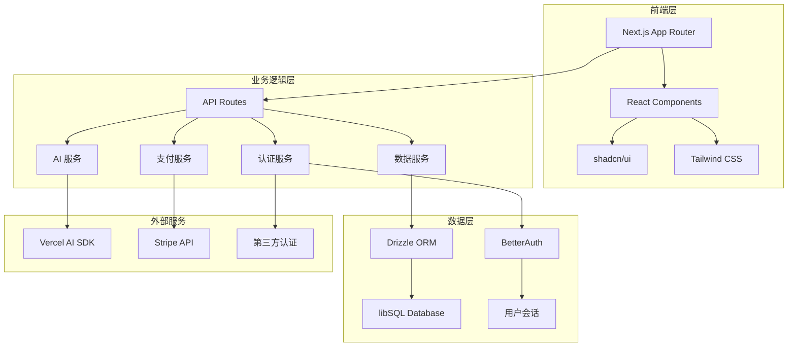

# vibetake

欢迎使用 vibetake！这是一个现代化的 Next.js 开发模板，专为快速构建生产级应用而设计。我们精心集成了当前最流行和实用的技术栈，让你能够在几分钟内启动一个功能完整的项目。

## 🌟 项目概述

vibetake 是一个开箱即用的全栈开发模板，它不仅仅是一个简单的脚手架，而是一个经过深思熟虑的开发解决方案。我们的目标是让开发者能够专注于业务逻辑的实现，而不是花费大量时间在基础设施的搭建上。

### 核心理念

- **开发效率优先** - 预配置的开发环境和工具链
- **类型安全** - 全面的 TypeScript 支持和类型检查
- **现代化架构** - 采用最新的 React 和 Next.js 特性
- **生产就绪** - 内置性能优化和最佳实践
- **可扩展性** - 模块化设计，易于扩展和维护

## ✨ 主要特性

### 前端技术栈
- **🚀 Next.js 15** - 最新版本的 React 框架，支持 App Router 和 Server Components
- **⚡ TypeScript** - 类型安全的 JavaScript 超集，提供更好的开发体验
- **🎨 Tailwind CSS v4** - 现代化的原子化 CSS 框架，快速构建美观界面
- **🧩 shadcn/ui** - 高质量的 React 组件库，基于 Radix UI 构建
- **🎭 Framer Motion** - 强大的动画库，创建流畅的用户交互

### 后端与数据
- **🔐 BetterAuth** - 现代化的认证解决方案，支持多种登录方式
- **🗄️ Drizzle ORM + libSQL** - 类型安全的数据库操作，支持本地和云端部署
- **🤖 Vercel AI SDK** - AI 功能集成，轻松构建智能应用
- **💳 Stripe** - 完整的支付系统集成，支持订阅和一次性付款

### 开发工具
- **📚 Fumadocs** - 优雅的文档系统，自动生成 API 文档
- **🔧 Biome** - 快速的代码格式化和 lint 工具
- **🚀 Turbopack** - 极速的构建工具，提升开发体验

## 🏗️ 系统架构



## 🎯 适用场景

vibetake 经过精心设计，适合以下类型的项目：

### SaaS 应用
- **用户管理** - 完整的注册、登录、权限管理系统
- **订阅计费** - 集成 Stripe 的订阅和计费功能
- **多租户支持** - 灵活的数据隔离和权限控制

### 内容管理系统
- **富文本编辑** - 强大的内容创建和编辑功能
- **媒体管理** - 文件上传、处理和存储
- **SEO 优化** - 内置的 SEO 最佳实践

### AI 应用
- **智能对话** - 集成 AI SDK 的聊天机器人
- **内容生成** - AI 驱动的内容创作工具
- **数据分析** - 智能数据洞察和可视化

### 企业应用
- **权限管理** - 基于角色的访问控制
- **审计日志** - 完整的操作记录和追踪
- **API 集成** - 与第三方系统的无缝集成

### 原型开发
- **快速验证** - 几分钟内搭建可用的原型
- **迭代开发** - 灵活的架构支持快速迭代
- **演示就绪** - 专业的 UI 和用户体验

## 💡 项目优势

### 开发效率
- **零配置启动** - 预配置的开发环境，立即开始编码
- **热重载** - 实时预览代码更改，提升开发效率
- **类型提示** - 完整的 TypeScript 支持，减少运行时错误

### 代码质量
- **最佳实践** - 遵循 React 和 Next.js 的最佳实践
- **代码规范** - 统一的代码风格和 lint 规则
- **测试友好** - 易于测试的模块化架构

### 性能优化
- **服务端渲染** - 更快的首屏加载和更好的 SEO
- **代码分割** - 自动的代码分割和懒加载
- **图片优化** - 内置的图片优化和 WebP 支持

### 安全性
- **认证安全** - 现代化的认证机制和会话管理
- **数据保护** - 类型安全的数据库操作
- **CSRF 防护** - 内置的安全防护机制

## 🚀 快速开始

选择最适合你的方式开始使用 vibetake：

### 方式一：使用 vibetake CLI（推荐）

```bash
# 安装 CLI 工具
npm i -g vibetake

# 创建新项目
vibe template my-project

# 进入项目目录
cd my-project

# 启动开发服务器
npm run dev
```

### 方式二：克隆仓库

```bash
# 克隆模板仓库
git clone https://github.com/wangenius/vibetake-template.git my-project

# 进入项目目录
cd my-project

# 安装依赖
npm install

# 启动开发服务器
npm run dev
```

### 方式三：GitHub 模板

1. 访问 [GitHub 仓库](https://github.com/wangenius/vibetake-template)
2. 点击 "Use this template" 按钮
3. 创建你的新仓库
4. 克隆到本地开始开发

## 🛠️ 技术栈详解

### 核心框架
| 技术 | 版本 | 用途 | 优势 |
|------|------|------|------|
| Next.js | 15.x | React 框架 | App Router, Server Components, 性能优化 |
| React | 19.x | UI 库 | 最新特性, Concurrent Features |
| TypeScript | 5.x | 类型系统 | 类型安全, 更好的开发体验 |

### UI 和样式
| 技术 | 版本 | 用途 | 优势 |
|------|------|------|------|
| Tailwind CSS | 4.x | CSS 框架 | 原子化, 高度可定制 |
| shadcn/ui | 最新 | 组件库 | 高质量, 可访问性 |
| Radix UI | 最新 | 无头组件 | 可访问性, 键盘导航 |
| Framer Motion | 12.x | 动画库 | 流畅动画, 手势支持 |

### 后端和数据
| 技术 | 版本 | 用途 | 优势 |
|------|------|------|------|
| BetterAuth | 1.x | 认证系统 | 现代化, 多提供商支持 |
| Drizzle ORM | 0.44.x | 数据库 ORM | 类型安全, 性能优化 |
| libSQL | 最新 | 数据库 | SQLite 兼容, 边缘计算 |

## 📊 性能指标

vibetake 在性能方面表现优异：

- **首屏加载时间** < 1.5s
- **Lighthouse 评分** > 95
- **Core Web Vitals** 全绿
- **包大小** < 200KB (gzipped)

## 📖 文档导航

### 快速入门
- **[安装指南](/docs/installation)** - 详细的安装和环境配置
- **[快速开始](/docs/getting-started/quick-start)** - 5 分钟内启动你的项目
- **[项目结构](/docs/getting-started/project-structure)** - 了解代码组织方式

### 框架集成
- **[认证系统](/docs/frameworks/authentication)** - BetterAuth 使用指南
- **[数据库操作](/docs/frameworks/database)** - Drizzle ORM 最佳实践
- **[AI 集成](/docs/frameworks/ai-integration)** - Vercel AI SDK 使用教程
- **[支付系统](/docs/frameworks/payment)** - Stripe 集成指南

### API 文档
- **[认证 API](/docs/api/authentication)** - 用户认证相关接口
- **[搜索 API](/docs/api/search)** - 搜索功能接口文档

### 组件库
- **[UI 组件](/docs/components/ui-components)** - shadcn/ui 组件使用指南

### 部署和运维
- **[部署指南](/docs/guides/deployment)** - 将应用部署到生产环境
- **[性能优化](/docs/guides/performance)** - 性能优化最佳实践
- **[安全指南](/docs/guides/security)** - 安全配置和最佳实践

## 🌍 社区和支持

### 获取帮助
- **📚 文档** - 详细的使用指南和 API 文档
- **💬 GitHub Discussions** - 社区讨论和问答
- **🐛 Issues** - [报告 Bug 和功能请求](https://github.com/wangenius/vibetake-template/issues)
- **📧 邮件支持** - 企业级支持服务

### 贡献指南
- **🤝 参与贡献** - 欢迎提交 PR 和改进建议
- **📝 文档改进** - 帮助完善文档内容
- **🎨 设计贡献** - UI/UX 设计改进
- **🧪 测试用例** - 添加测试用例和示例

### 社区资源
- **🎯 示例项目** - 基于 vibetake 的实际项目
- **📺 视频教程** - 详细的使用教程和最佳实践
- **📖 博客文章** - 技术分享和使用心得
- **🎪 在线演示** - 实时体验模板功能

## 🎉 开始你的项目

准备好开始了吗？选择一个快速开始的方式，几分钟内就能拥有一个功能完整的现代化应用！

```bash
# 一键创建项目
npx create-vibe-app my-awesome-project

# 或者使用 CLI
npm i -g vibetake && vibe template my-awesome-project
```

让我们一起构建下一个伟大的应用！ 🚀
